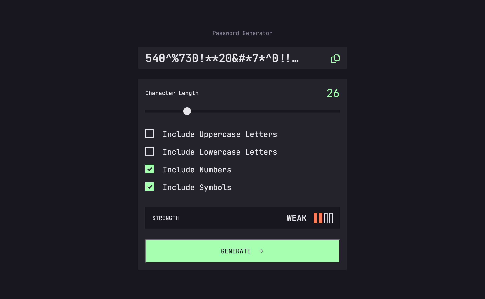

# Frontend Mentor - Password generator app solution

This is a solution to the [Password generator app challenge on Frontend Mentor](https://www.frontendmentor.io/challenges/password-generator-app-Mr8CLycqjh). Frontend Mentor challenges help you improve your coding skills by building realistic projects.

## Table of contents

-   [Overview](#overview)
    -   [The challenge](#the-challenge)
    -   [Screenshot](#screenshot)
    -   [Links](#links)
-   [My process](#my-process)
    -   [Built with](#built-with)
    -   [What I learned](#what-i-learned)
    -   [Continued development](#continued-development)
    -   [Useful resources](#useful-resources)
-   [Author](#author)
-   [Acknowledgments](#acknowledgments)

## Overview

### The challenge

Users should be able to:

-   Generate a password based on the selected inclusion options
-   Copy the generated password to the computer's clipboard
-   See a strength rating for their generated password
-   View the optimal layout for the interface depending on their device's screen size
-   See hover and focus states for all interactive elements on the page

### Screenshot

### Links

-   Solution URL: [https://github.com/labihi/password-generator-web-app]
-   Live Site URL: [https://kaleidoscopic-raindrop-742190.netlify.app/]

## My process

### Built with

-   Semantic HTML5 markup
-   CSS custom properties
-   Flexbox
-   Mobile-first workflow
-   Vanilla Javascfript

### What I learned

I learnt how to position elements in a proper way by following closely the designs in the provided files.
I also learnt how to style elements like range input and checkboxes, which are hard to style.

### Continued development

I will work into improving the style of my solution and use it as a base to learn how to write tests and use a frontend framework and a css framework like tailwind as well.

### Useful resources

-   [How to style a range input](https://css-tricks.com/styling-cross-browser-compatible-range-inputs-css/) - This helped me for creating a custom styled range input
-   [How to style checkboxes](https://moderncss.dev/pure-css-custom-checkbox-style/) - This is an amazing article which helped me finally understand how to customize checkboxes

## Author

-   Lorenzo "Labihi" Garibaldi - [Lorenzo "Labihi" Garibaldi](https://www.your-site.com)
-   Frontend Mentor - [@labihi](https://www.frontendmentor.io/profile/labihi)
